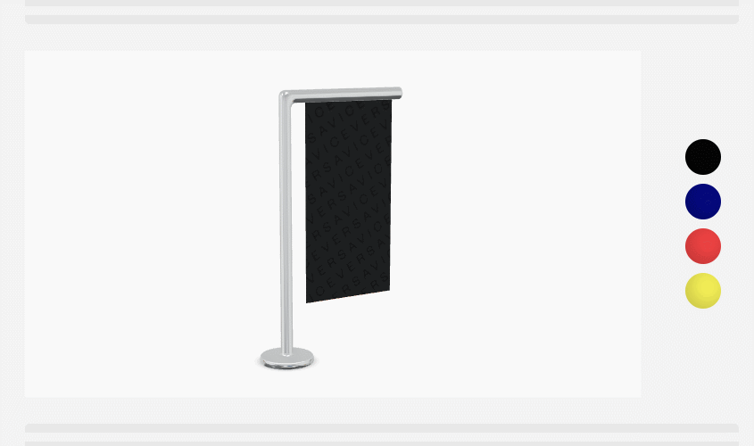

# Context
Our viewer is one of our core technical components. It is embedded on our clients' websites and used on our SaaS platform.

For this exercise, your job is to create a basic ThreeJS viewer, create a vertex shader and allow customization through an iframe API.

In addition to your code, a README explaining your thought process and your choices would be appreciated.


# Exercise

### 1) The ThreeJS viewer
Create a ThreeJS viewer to display the [model provided](./attachments/flagvv.zip).
- Make sure we can run it locally as a web server on the `8080` port.
- You can `npm init` in the `./viewer/` directory and use whatever tools you like.

### 2) The vertex shader
Create a vertex shader from scratch that makes the model wave like flag.

### 3) The iframe API
Provide an iframe API that allows the object's color to be changed dynamically.

- You can run the "client website" using
  ```
  cd ./client
  npm i
  npm start
  ```
- This page is already setup to display `http://localhost:8080` inside an iframe and send commands when clicking on the color circles.
- You can make the all the changes you want in this page.



## Do you want to make the viewer even better?
Feel free to make as many improvements as you like. We love creativity and technical challenges.

If you are out of ideas, here are some thoughts:

- When embedded on our client's ecommerce websites, our viewer is used by a lot of non-technical people that are mainly there to shop and often don't know how to use 3D tools/apps. How could you make the experience simpler yet better for them?
- We help high-end brands sell real-life products. So we aim to reproduce reality as close as possible while maintaining high performance. What details in the rendering or animation could improve the realism?